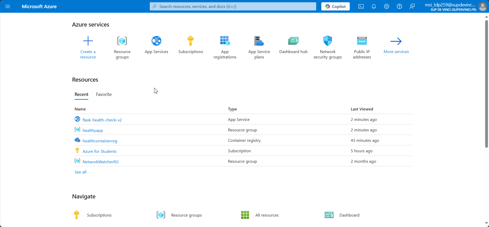

# 🌱 Flask Health Check API 🌱

Une application Web simple développée avec Flask pour effectuer des calculs de santé de base comme l'indice de masse corporelle (BMI) et le taux métabolique de base (BMR). Elle est déployée sur Azure App Service. 🚀




📜 Prérequis
⚙️ Installation
🏃‍♂️ Utilisation
🩺 Vérifier la santé de l'application
⚖️ Calculer le BMI
🔥 Calculer le BMR
🚀 Déploiement sur Azure

### ⚡ Prérequis

*Avant de commencer, assure-toi d'avoir ces éléments :*

Python 3.12 ou supérieur 🐍
Flask (Utilisé pour développer l'API) 💻
Azure Subscription 🌐
Docker (si utilisé localement) 🐳
Un outil comme curl ou un navigateur pour tester les endpoints 🌍
⚙️ Installation
1️⃣ Cloner le dépôt
Clone ce projet dans ton répertoire local :

```bash
Copier
git clone https://github.com/MeryembentalebEJ/health_app.git
cd health_app
```

2️⃣ Installer les dépendances
Installe les dépendances requises dans un environnement virtuel (recommandé) :

```bash
Copier
python -m venv venv
source venv/bin/activate  # Sur Windows, utilise venv\Scripts\activate
pip install -r requirements.txt
```

## 🏃‍♂️ Utilisation

🩺 Vérifier la santé de l'application
Pour vérifier si l'API est en ligne et fonctionnelle, envoie une requête GET à l'endpoint /health :

```bash
Copier
curl https://flask-health-check-v2.azurewebsites.net/health
Réponse attendue :

json
Copier
{
  "status": "healthy"
}
```

## ⚖️ Calculer le BMI
Pour calculer l'indice de masse corporelle (BMI), envoie une requête POST à l'endpoint /bmi avec height et weight dans le corps de la requête :

```bash
Copier
curl -X POST https://flask-health-check-v2.azurewebsites.net/bmi \
     -H "Content-Type: application/json" \
     -d '{"height": 1.75, "weight": 70}'
Réponse attendue :

json
Copier
{
  "bmi": 22.86
}

```

## 🔥 Calculer le BMR
Pour calculer le taux métabolique de base (BMR), envoie une requête POST à l'endpoint /bmr avec height, weight, age et gender dans le corps de la requête :

```bash
Copier
curl -X POST https://flask-health-check-v2.azurewebsites.net/bmr \
     -H "Content-Type: application/json" \
     -d '{"height": 1.75, "weight": 70, "age": 25, "gender": "female"}'
Réponse attendue :

json
Copier
{
  "bmr": 1505.10
}
```
🚀 Déploiement sur Azure
1️⃣ Déploiement sur Azure App Service
Si tu veux déployer cette API sur Azure, voici les étapes :

Crée un Azure Container Registry (ACR) pour héberger l'image Docker.
Déploie l'application dans Azure App Service en utilisant les configurations Docker et ACR pour récupérer l'image.
Azure générera un pipeline CI/CD automatique si tu connectes ton projet GitHub avec Azure.


🎉🎉🎉🎉


